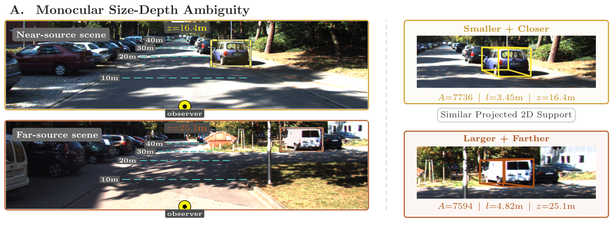
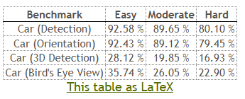
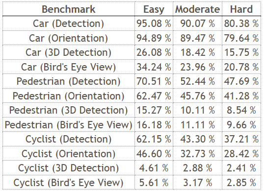

# MonoPRIO: Monocular 3D Object Detection with Query-Adaptive Prior Conditioning

This repository hosts the official implementation of MonoPRIO, a model for monocular 3D detection with query-adaptive prior conditioning for robust size estimation under size-depth ambiguity. MonoPRIO builds upon [MonoDETR](https://github.com/ZrrSkywalker/MonoDETR) and [MonoDGP](https://github.com/pufanqi23/monodgp).

Our core idea is to stabilise ambiguous monocular size estimation with class-aware offline prior banks, query-level routed mixture priors, uncertainty-aware log-space size conditioning, and CAP regularisation in the size pathway.


<div align="center">
  
</div>

## KITTI Validation Results

The table below reports per seed validation results (R40) for our unified model and median of 5 values used in our paper. For baseline results of MonoDGP and MonoCLUE please refer [here](#baseline-validation-logs-local-5-seed-comparison).

<table>
  <tr>
    <td rowspan="2" align="center"><b>Run</b></td>
    <td colspan="3" align="center"><b>Car AP<sub>BEV|R40</sub></b></td>
    <td colspan="3" align="center"><b>Car AP<sub>3D|R40</sub></b></td>
    <td colspan="3" align="center"><b>Ped. AP<sub>3D|R40</sub></b></td>
    <td colspan="3" align="center"><b>Cyc. AP<sub>3D|R40</sub></b></td>
    <td rowspan="2" align="center"><b>Log</b></td>
    <td rowspan="2" align="center"><b>Checkpoint</b></td>
  </tr>
  <tr>
    <td align="center">E</td><td align="center">M</td><td align="center">H</td>
    <td align="center">E</td><td align="center">M</td><td align="center">H</td>
    <td align="center">E</td><td align="center">M</td><td align="center">H</td>
    <td align="center">E</td><td align="center">M</td><td align="center">H</td>
  </tr>
  <tr>
    <td align="center">Seed 444</td>
    <td align="center">37.7385</td><td align="center">27.4488</td><td align="center">24.7231</td>
    <td align="center">30.4130</td><td align="center">21.9274</td><td align="center">18.7024</td>
    <td align="center">12.4075</td><td align="center">9.6523</td><td align="center">7.4288</td>
    <td align="center">10.2545</td><td align="center">5.3419</td><td align="center">5.0021</td>
    <td align="center"><a href="https://drive.google.com/file/d/1jMVHLFyUKMYfSEsJZS-43cYGChWDfmiG/view?usp=drive_link">log</a></td>
    <td align="center"><a href="https://drive.google.com/file/d/1UENFz-poULnTnfwKJoNal6sIgpDFXVfO/view?usp=drive_link">ckpt</a></td>
  </tr>
  <tr>
    <td align="center">Seed 445</td>
    <td align="center">40.3231</td><td align="center">28.7343</td><td align="center">25.1377</td>
    <td align="center">31.0523</td><td align="center">21.9635</td><td align="center">19.5214</td>
    <td align="center">12.2332</td><td align="center">9.3608</td><td align="center">7.1981</td>
    <td align="center">14.9668</td><td align="center">7.9881</td><td align="center">7.0977</td>
    <td align="center"><a href="https://drive.google.com/file/d/1v0hvl1Piij-DLQ_IhxiYpEc_xicRDzOu/view?usp=drive_link">log</a></td>
    <td align="center"><a href="https://drive.google.com/file/d/1V83VJebqvIOMoThm7k_QAD7XqxXbuIdb/view?usp=drive_link">ckpt</a></td>
  </tr>
  <tr>
    <td align="center">Seed 446</td>
    <td align="center">38.3903</td><td align="center">28.5380</td><td align="center">24.7171</td>
    <td align="center">30.1636</td><td align="center">21.7001</td><td align="center">18.9655</td>
    <td align="center">10.9028</td><td align="center">7.9890</td><td align="center">6.3868</td>
    <td align="center">12.4020</td><td align="center">5.9881</td><td align="center">5.8987</td>
    <td align="center"><a href="https://drive.google.com/file/d/1NlRvJeQpM8bTkJJjSHVv35-qynNcEpQn/view?usp=drive_link">log</a></td>
    <td align="center"><a href="https://drive.google.com/file/d/19aj2vIZBB8XFKyYvJNvJnLHvFM3IZnIm/view?usp=drive_link">ckpt</a></td>
  </tr>
  <tr>
    <td align="center">Seed 447</td>
    <td align="center">35.8443</td><td align="center">26.6558</td><td align="center">23.4343</td>
    <td align="center">27.4737</td><td align="center">20.8672</td><td align="center">18.0712</td>
    <td align="center">13.1752</td><td align="center">9.9896</td><td align="center">7.7053</td>
    <td align="center">10.9032</td><td align="center">5.8934</td><td align="center">5.1463</td>
    <td align="center"><a href="https://drive.google.com/file/d/1l7dEzcsJZajkSvkA_pmclUBKlBH_DzYP/view?usp=drive_link">log</a></td>
    <td align="center"><a href="https://drive.google.com/file/d/12uhZf6MgomePH-bqYfLzW8oxJiBBMwZ6/view?usp=drive_link">ckpt</a></td>
  </tr>
  <tr>
    <td align="center">Seed 448</td>
    <td align="center">40.6979</td><td align="center">28.8151</td><td align="center">25.0044</td>
    <td align="center">31.3979</td><td align="center">21.8560</td><td align="center">19.2577</td>
    <td align="center">12.7353</td><td align="center">9.1760</td><td align="center">7.3320</td>
    <td align="center">13.5628</td><td align="center">6.7914</td><td align="center">6.2966</td>
    <td align="center"><a href="https://drive.google.com/file/d/1GMa-hoV6NXh-n72W49wJgxZZ3CFthNPf/view?usp=drive_link">log</a></td>
    <td align="center"><a href="https://drive.google.com/file/d/1HQFgdLFuOAyPIxatB75aoTDcSN9_6Kmt/view?usp=drive_link">ckpt</a></td>
  </tr>
  <tr>
    <td align="center"><b>Median of 5 (paper)</b></td>
    <td align="center"><b>38.390</b></td><td align="center"><b>28.538</b></td><td align="center"><b>24.723</b></td>
    <td align="center"><b>30.413</b></td><td align="center"><b>21.856</b></td><td align="center"><b>18.965</b></td>
    <td align="center"><b>12.408</b></td><td align="center"><b>9.361</b></td><td align="center"><b>7.332</b></td>
    <td align="center"><b>12.402</b></td><td align="center"><b>5.988</b></td><td align="center"><b>5.899</b></td>
    <td align="center">-</td>
    <td align="center">-</td>
  </tr>
</table>

## KITTI Official Test Results

We also provide test set checkpoints and prediction files for direct verification on the [KITTI 3D object detection benchmark](https://www.cvlibs.net/datasets/kitti/user_login.php).

### Unified model

<table>
  <tr>
    <td rowspan="2" align="center"><b>Model</b></td>
    <td colspan="3" align="center"><b>Car AP<sub>BEV|R40</sub></b></td>
    <td colspan="3" align="center"><b>Car AP<sub>3D|R40</sub></b></td>
    <td colspan="3" align="center"><b>Ped. AP<sub>3D|R40</sub></b></td>
    <td colspan="3" align="center"><b>Cyc. AP<sub>3D|R40</sub></b></td>
    <td rowspan="2" align="center"><b>Checkpoint</b></td>
    <td rowspan="2" align="center"><b>Predictions</b></td>
  </tr>
  <tr>
    <td align="center">E</td><td align="center">M</td><td align="center">H</td>
    <td align="center">E</td><td align="center">M</td><td align="center">H</td>
    <td align="center">E</td><td align="center">M</td><td align="center">H</td>
    <td align="center">E</td><td align="center">M</td><td align="center">H</td>
  </tr>
  <tr>
    <td align="center">MonoPRIO</td>
    <td align="center">35.50</td><td align="center">24.66</td><td align="center">21.54</td>
    <td align="center">26.83</td><td align="center">18.93</td><td align="center">16.25</td>
    <td align="center">16.31</td><td align="center">10.74</td><td align="center">9.08</td>
    <td align="center">7.72</td><td align="center">4.32</td><td align="center">3.61</td>
    <td align="center"><a href="https://drive.google.com/file/d/1bhVoYP7TXfhqoCrc0ktjJ3PyGn27-NiE/view?usp=sharing">ckpt</a></td>
    <td align="center"><a href="https://drive.google.com/drive/folders/1TI2-yi3Tbh_nUDGDjVOjqNI4pkZXKjGL?usp=sharing">pred</a></td>
  </tr>
</table>

### Car-only model

<table>
  <tr>
    <td rowspan="2" align="center"><b>Model</b></td>
    <td colspan="3" align="center"><b>Car AP<sub>BEV|R40</sub></b></td>
    <td colspan="3" align="center"><b>Car AP<sub>3D|R40</sub></b></td>
    <td rowspan="2" align="center"><b>Checkpoint</b></td>
    <td rowspan="2" align="center"><b>Predictions</b></td>
  </tr>
  <tr>
    <td align="center">E</td><td align="center">M</td><td align="center">H</td>
    <td align="center">E</td><td align="center">M</td><td align="center">H</td>
  </tr>
  <tr>
    <td align="center">MonoPRIO</td>
    <td align="center">35.74</td><td align="center">26.05</td><td align="center">22.90</td>
    <td align="center">28.12</td><td align="center">19.85</td><td align="center">16.93</td>
    <td align="center"><a href="https://drive.google.com/file/d/1zBFXwdXcaOaWpWYZ2GWuefky6GNB8iA-/view?usp=drive_link">ckpt</a></td>
    <td align="center"><a href="https://drive.google.com/drive/folders/1kOfrvIsJ7U_FPP2Ey0yQu2MO7DKOisDH?usp=drive_link">pred</a></td>
  </tr>
</table>

Test results submitted to the official KITTI Benchmark:

Car category: 
<div>
  
</div>

All categories:
<div>
  
</div>

<a id="baseline-validation-logs-local-5-seed-comparison"></a>
## Baseline Validation Logs

For fairness and reproducibility, we also release the exact local validation logs used for the 5-seed median comparisons against MonoDGP and MonoCLUE.

MonoCLUE references:
- [Paper](https://arxiv.org/pdf/2511.07862v1)
- [GitHub](https://github.com/SungHunYang/MonoCLUE)

<table>
  <tr>
    <td rowspan="2" align="center"><b>Method</b></td>
    <td colspan="3" align="center"><b>Car AP<sub>BEV|R40</sub></b></td>
    <td colspan="3" align="center"><b>Car AP<sub>3D|R40</sub></b></td>
    <td colspan="3" align="center"><b>Ped. AP<sub>3D|R40</sub></b></td>
    <td colspan="3" align="center"><b>Cyc. AP<sub>3D|R40</sub></b></td>
  </tr>
  <tr>
    <td align="center">Easy</td><td align="center">Mod.</td><td align="center">Hard</td>
    <td align="center">Easy</td><td align="center">Mod.</td><td align="center">Hard</td>
    <td align="center">Easy</td><td align="center">Mod.</td><td align="center">Hard</td>
    <td align="center">Easy</td><td align="center">Mod.</td><td align="center">Hard</td>
  </tr>
  <tr>
    <td align="center">MonoDGP <br/> Pu et al. (2025)</td>
    <td align="center">37.451</td><td align="center">26.938</td><td align="center">24.416</td>
    <td align="center">29.536</td><td align="center">21.136</td><td align="center">18.802</td>
    <td align="center">12.311</td><td align="center">9.270</td><td align="center">7.268</td>
    <td align="center">9.813</td><td align="center">4.921</td><td align="center">4.422</td>
  </tr>
  <tr>
    <td align="center">MonoCLUE <br/> Yang et al. (2025)</td>
    <td align="center">38.249</td><td align="center">28.119</td><td align="center">24.656</td>
    <td align="center">29.344</td><td align="center">21.416</td><td align="center">18.495</td>
    <td align="center">11.658</td><td align="center">8.579</td><td align="center">7.043</td>
    <td align="center">11.180</td><td align="center">5.741</td><td align="center">5.259</td>
  </tr>
  <tr>
    <td align="center">MonoPRIO</td>
    <td align="center">38.390</td><td align="center">28.538</td><td align="center">24.723</td>
    <td align="center">30.413</td><td align="center">21.856</td><td align="center">18.965</td>
    <td align="center">12.408</td><td align="center">9.361</td><td align="center">7.332</td>
    <td align="center">12.402</td><td align="center">5.988</td><td align="center">5.899</td>
  </tr>
</table>

MonoDGP seed logs:
- [seed444](https://drive.google.com/file/d/11DuiJ-cJmVfw6e5khMUg2fyKKa0aQEDF/view?usp=drive_link)
- [seed445](https://drive.google.com/file/d/1Xey6Jw42Ajvg9_5tR5fYxZZsM0alunBg/view?usp=drive_link)
- [seed446](https://drive.google.com/file/d/1KRYEXNFIVgiH2a_vjcX2XAu8mlBgfKns/view?usp=drive_link)
- [seed447](https://drive.google.com/file/d/171ylGUyExqNm8PtFRh4wUXyK9tAHJZ1J/view?usp=drive_link)
- [seed448](https://drive.google.com/file/d/1xfZmKN6zxYrQ0VuuSYVOUdV5PjP0SY2n/view?usp=drive_link)

MonoCLUE seed logs:
- [seed444](https://drive.google.com/file/d/1RVUsTRQveQXI5l8WsJsEPrDw4iNJMpi-/view?usp=drive_link)
- [seed445](https://drive.google.com/file/d/1mcHQtWT7S0aimEMkuSTKRJtPvzH2Es-_/view?usp=drive_link)
- [seed446](https://drive.google.com/file/d/1mCAv9ZRirRv_t_vk80nk5FYIVNJU4MpJ/view?usp=drive_link)
- [seed447](https://drive.google.com/file/d/1ZKM8SKusTBeLqtZOATcWsK1wdhgZQgpq/view?usp=drive_link)
- [seed448](https://drive.google.com/file/d/1C2T57KBn3aOZA5TMEmqKew5O-dmrZbrw/view?usp=drive_link)


## Installation
1. Clone this project and create a conda environment:
    ```bash
    git clone https://github.com/bigggs/MonoPRIO.git
    cd MonoPRIO

    conda create -n monoprio python=3.10 -y
    conda activate monoprio
    ```
    
2. Install pytorch and torchvision matching your CUDA version:
    ```bash
    pip install torch==2.10.0 torchvision==0.25.0 --index-url https://download.pytorch.org/whl/cu130

    ```
    
3. Install requirements and compile the deformable attention:
    ```bash
    pip install -r requirements.txt

    cd lib/models/monoprio/ops/
    bash make.sh
    
    cd ../../../..
    ```
 
4. Download [KITTI](http://www.cvlibs.net/datasets/kitti/eval_object.php?obj_benchmark=3d) datasets and prepare the directory structure as:
    ```bash
    │MonoPRIO/
    ├──...
    │data/kitti/
    ├──ImageSets/
    ├──training/
    │   ├──image_2
    │   ├──label_2
    │   ├──calib
    ├──testing/
    │   ├──image_2
    │   ├──calib
    ```

5. Prepare prior banks

   Option A: download and use our priors

   Place downloaded files under `MonoPRIO/priors/` then set `model/prior_path` in your config.

   | Setup | Bank | Link |
   |---|---|---|
   | Validation | Unified | [Download](https://drive.google.com/file/d/1T0KXFiafpbZPPjXp0arM9BumrDE4z6X4/view?usp=drive_link) |
   | Validation | Car-only | [Download](https://drive.google.com/file/d/1qmygCm1Xd4AsrsGlYfQSXv1V--Y7R9Sa/view?usp=drive_link) |
   | Test | Unified | [Download](https://drive.google.com/file/d/1cL78_C76hhl90YsPP3cy5F-dG6w6mSdD/view?usp=drive_link) |
   | Test | Car-only | [Download](https://drive.google.com/file/d/1tKuCKl2u5G-pYElvkfnQ-v1leIp_qsSc/view?usp=drive_link) |

   **Option B: generate priors locally from KITTI labels/images**

   Install CLIP:
   ```bash
   pip install git+https://github.com/openai/CLIP.git
   ```

   Generate priors from the config split (defaults to `dataset.train_split` in `configs/monoprio.yaml`):
   ```bash
   python tools/build_priors.py --config configs/monoprio.yaml --out-dir priors
   ```


   To split a unified bank into per-class banks (`ped/car/cyclist`) (for if you want to just train on the car class):
   ```bash
   python tools/split_banks.py --input priors/priors_unified.npz --out-dir priors/individual_banks
   ```

   By default, training uses:
   ```yaml
   model:
     prior_path: 'priors/priors_unified.npz'
   ```
   Update this path in your config if you want to use a different bank file.
    
## Get Started

### Train
You can modify the settings of models and training in `configs/monoprio.yaml` and indicate the GPU in `train.sh`:
  ```bash
  bash train.sh configs/monoprio.yaml > logs/monoprio.log
  ```
### Test
The best checkpoint will be evaluated as default. You can change it at "tester/checkpoint" in `configs/monoprio.yaml`:
  ```bash
  bash test.sh configs/monoprio.yaml
  ```
You can test the inference time on your own device:
  ```bash
  python tools/test_runtime.py
  ```
## Citation

If you find our work useful in your research, please consider giving us a star and citing:

```latex
@misc{davies2026monoprioadaptivepriorconditioning,
      title={MonoPRIO: Adaptive Prior Conditioning for Unified Monocular 3D Object Detection}, 
      author={Leon Davies and Qinggang Meng and Mohamad Saada and Baihua Li and Simon Sølvsten},
      year={2026},
      eprint={2605.14781},
      archivePrefix={arXiv},
      primaryClass={cs.CV},
      url={https://arxiv.org/abs/2605.14781}, 
}
```

## Acknowlegment
This repo benefits from the excellent work [MonoDETR](https://github.com/ZrrSkywalker/MonoDETR), and [MonoDGP](https://github.com/pufanqi23/monodgp). If you find this work useful, please also consider checking out and citing their work.
